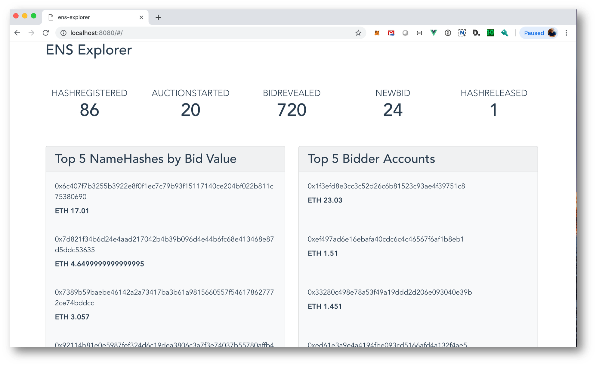

# Ethereum Name Service (ENS) Explorer

This application visualizes recent [ENS](https://ens.domains/) transactions with a focus on `BidRevealed` event logs.

## Installation

```bash
# clone this repo
$ git clone https://github.com/amitdeshmukh/ens-explorer.git

# install dependencies
$ npm install

# serve with hot reload at localhost:8080
$ npm run dev

# build for production with minification
$ npm run build

# run all tests
$ npm test
```

## Usage

Browse to [http://localhost:8080](http://localhost:8080)

Please allow events to stream into the app.

The app will perform some calculations as new data comes in. This process can take about half a minute.

Currently, the app will display:
- A summary of ENS contract events

- Metrics related to `BidRevealed` events:
  - Top 5 NameHashes by bid value
  - Top 5 bidding accounts

- Individual `BidRevealed` events are also displayed.


[](src/assets/ens-explorer-video.mov)

## Notes

The app uses [Infura](https://infura.io/) websockets to connect to the Ethereum mainnet, and receive ENS contract events. This was done so that using the app would not require to setup a  local geth/parity node, and events can be streamed into the app immediately.

The drawback of this approach however, is that Infura websockets seem to not provide event logs that are older than 2 days. The performance is optimal when events within the past 1 day of blocks are requested.

## Todo

1. Write Unit Tests
2. Read web3 parameters from config
3. Implement additional Event metrics
